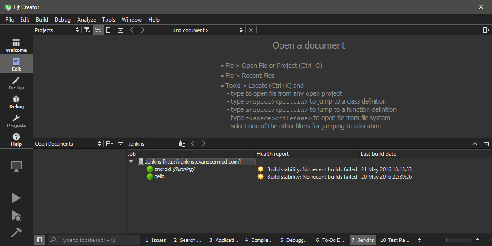
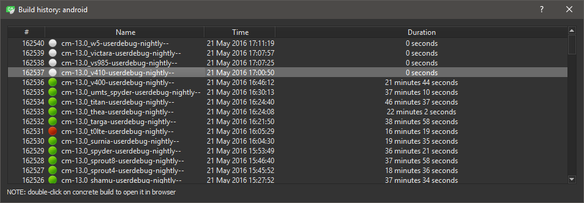
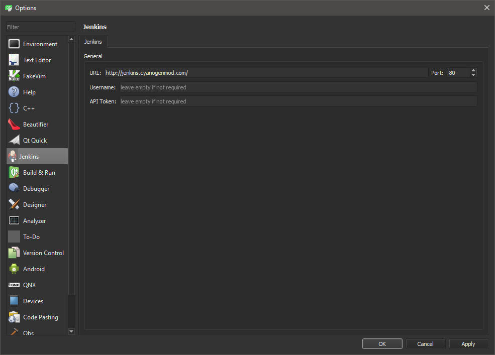

# Jenkins CI plugin

## Intro
Simple Qt Creator plugin for Jenkins job status monitoring

## Features
* checks job running status
* shows "Health report" information
* shows build history for selected job
  
* supports authorization ([How to get API token for authorization](https://wiki.jenkins-ci.org/display/JENKINS/Authenticating+scripted+clients))

## Installation

### From source

1. Change `QTCREATOR_SOURCES` and `IDE_BUILD_TREE`:
 - set `QTCREATOR_SOURCES` = path to Qt Creator source dir (with qtcreator.pro)
 - set `IDE_BUILD_TREE` = path to compiled Qt Creator dir (with bin,lib,libexec,...)
2. Compile plugin
3. Copy compiled plugin to <Qt Creator dir>/lib/qtcreator/plugins
4. Enable "JenkinsPlugin" in Help → About Plugins...
5. Restart Qt Creator

## Configuration
Go to Tools → Options → Jenkins and add your Jenkins CI URL to "URL" field.
You can also reconfigure default port and add credentials. If authorization is
not required - leave "Username" and "API token" empty.

## TODO

* implement "Views" support

## License

This project is licensed under the MIT License - see the [LICENSE](./LICENSE) file for details
